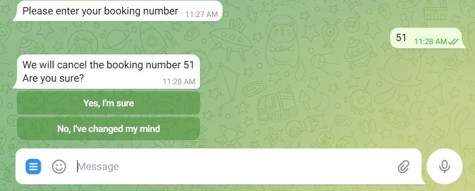

## Requirements for Assignment-2

[Read the instruction](https://github.com/STIW3054-A221/class-activity-soc/blob/main/Assignment-2.md)

## Your Info:

1. 279045
2. Ginveree Kong May Cheng

3. 

4. +6016-3359938
2. Other related info (if any)

## Introduction

GinvereeBot is a bot where that handle room booking. It has 2 types of user which are admin and user, which is the
customer. In this part, we will be focusing more on user. For user, there are a total of 3 functions in it.

Firstly, book a room. This is where user will have to select which room user wants to book and enter personal details in
it for booking purposes. If user entered wrong personal details, user can change it instantly before confirming the
booking. After the booking has been confirmed, a booking ID will be given to user for tracking purposes. Booking ID is
extremely important for further use

Second function is update personal details. GinvereeBot has considered that user might overlook and realized the
personal details are incorrect. Therefore, this function is provided for user to update the personal details after-hand.
User will have to provide (key in) the booking ID in order to update.

Next function is cancel booking. Booking that has been made can be cancelled after considerations. User will have to
enter booking Id and the cancellation processes will be done.

## Flow Diagram of the requirements (Use: https://app.diagrams.net/)

## Result/Output (Screenshot of the output)

1. User enters the chat

2. After pressing /start, user selects identity (admin/user)

3. Asking user to select what would they want to do

4. Prompt user to input the amount of people in the room (with options)

5. Display rooms based on user's selected amount and prompt user to input room ID

6. After user enters the room ID, prompt user to input their personal details

7. When user entered all the details, ask user to check their input personal details. If user wants to make some changes
   on the personal details, select on "I would like to make some corrections".

8. To making changes towards user's personal details, user will have to select what user would like to change

9. For example, if user wants to change the name, user has to follow the instructions given by GinvereeBot. User are
   allowed to make unlimited changes before selecting "Yes!"

10. If user selects "Yes!", user's details will be recorded and a unique booking number will be given to user.

11. This is the database for guest details when user confirmed their booking.

12. After some time, if user wants to update their details, they can reopen the chat and select on "Update Personal
    Details"

13. Instructions should be followed by user and the detail will be updated.

14. For cancel booking, user have to select on "Cancel Booking".

15. GinvereeBot will prompt user to enter their booking number for cancellation purposes. After user entered and the
    system found the booking ID in database, GinvereeBot will reconfirm with user before cancelling the booking.

16. If user selects "No, I've changed my mind", the cancellation will not be done.

17. If user selects "Yes, I'm sure", the booking will be cancelled. User has the option to book a new room or to end the
    chat.

18. When user selects "No, thank you", the chat will end with "Thank you, Hope to see you again!".

## UML Class Diagram

## Database design

## Youtube Presentation

https://youtu.be/bfvlyAxkzjc

## References (Not less than 10)

[1] Lisandro Fernigrini, "What Is a One-to-Many Relationship in a Database? An Explanation with Examples," Vertabelo
Data Modeler, January 07, 2021. Available: https://vertabelo.com/blog/one-to-many-relationship/. Retrieved on December
05, 2022.

[2] forpas, "Trying to store information from database into array?" Stack Overflow, November 04, 2020.
Available: https://stackoverflow.com/questions/64687399/trying-to-store-information-from-database-into-array. Retrieved
on December 05, 2022.

[3] "Telegram Bot API,"Telegram APIs, (n.d). Available: https://core.telegram.org/bots/api. Retrieved on December 05,
2022.

[4] Viral Vaghela, "How to create a Telegram bot using java?," Medium, December 22, 2020.
Available: https://vaghelaviral.medium.com/how-to-create-a-telegram-bot-using-java-5710bed16c0f. Retrieved on December
07, 2022.

[5] Brian, "Telegram Bot in Java, introduction for developers" CodeGym, August 13, 2020.
Available: https://codegym.cc/groups/posts/telegram-bot-in-java. Retrieved on December 07, 2022.

[6] GeeksforGeeks, "Split() String method in Java with examples," GeeksforGeeks, July 11, 2022.
Available: https://www.geeksforgeeks.org/split-string-java-examples/. Retrieved on December 10, 2022.

[7] baeldung, "Java.String.split(),"Baeldung, December 18, 2022. Available: https://www.baeldung.com/string/split.
Retrieved on December 10, 2022.

[8] Tehreem Naeem, "All You Need to Know About Database Design" Astera, October 01, 2022.
Available: https://www.astera.com/type/blog/all-you-need-to-know-about-database-design/. Retrieved on December 10, 2022.

[9] MonsterDeveloper, "Lesson 6. Inline keyboards and editing message's text," GitHub, April 05, 2022.
Available: https://github.com/MonsterDeveloper/java-telegram-bot-tutorial/blob/master/lesson-6.-inline-keyboards-and-editing-messages-text.md
. Retrieved on December 14, 2022.

[10] Nam Ha Minh, "Java Connect to SQLite with JDBC Example," CodeJava, October 25, 2020.
Available: https://www.codejava.net/java-se/jdbc/connect-to-sqlite-via-jdbc. Retrieved on December 14, 2022.

[11] Ramu Vudugula, "Connecting to SQLite Database in a Java Web Application," Helical IT Solutions Pvt Ltd, April 12,
2019. Available: https://helicaltech.com/connecting-sqlite-database-java-web-application/. Retrieved on December 15,
2022.

[12] Richard Peterson, "MySQL AUTO_INCREMENT with Examples" Guru99, December 03, 2022.
Available: https://www.guru99.com/auto-increment.html. Retrieved on December 16, 2022.

[13] Ravikiran A S, "What is SQLite? Everything You Need to Know," Simplilearn.com, November 23, 2022.
Available: https://www.simplilearn.com/tutorials/sql-tutorial/what-is-sqlite. Retrieved on December 16, 2022.

[14] Richard Peterson, "MySQL UPDATE Query with Example" Guru99, December 03, 2022.
Available: https://www.guru99.com/sql-update-query.html#:~:text=MySQL%20Update%20Command%20Syntax&text=UPDATE%20%60table_name%60%20is%20the%20command,must%20be%20in%20single%20quotes
. [Accessed December 14, 2022].

[15] Richard Peterson, "MySQL INSERT INTO Query: How to add Row in Table (Example)" Guru99, December 03, 2022.
Available: https://www.guru99.com/insert-into.html. Retrieved on December 17, 2022.

[16] Arjun Thakur, "How to delete data in a MySQL database with Java?" Simplilearn.com, June 26, 2020.
Available: https://www.tutorialspoint.com/how-to-delete-data-in-a-mysql-database-with-java#. Retrieved on December
17,2022.

[17] Alvin Alexander, "A Java MySQL DELETE example" alvin alexander, September 30, 2019.
Available: https://alvinalexander.com/java/java-mysql-delete-query-example/. Retrieved on December 17, 2022.

[18] Software Testing Help, "Java Timer – How To Set A Timer In Java With Examples," Software Testing Help, December 05,
2022. Available: https://www.softwaretestinghelp.com/java/java-timer-tutorial/. Retrieved on December 17, 2022.

## JavaDoc

http://localhost:63342/assignment-2-Ginveree/STIW3054-Assignment-2/JavaDoc/index.html?_ijt=97u06phc2fh4psd305dea1qus0&_ij_reload=RELOAD_ON_SAVE